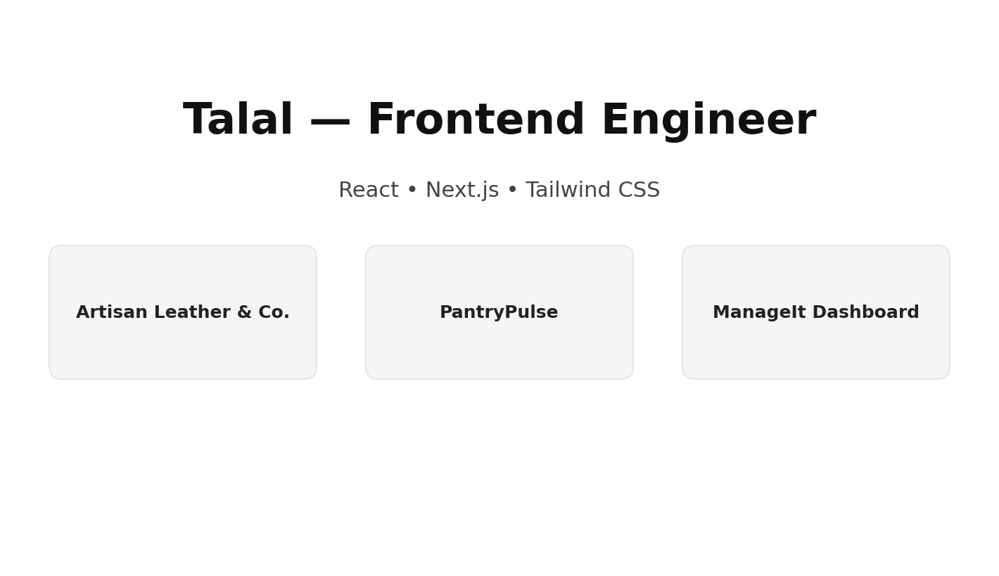

# Portfolio Website — Next.js + Tailwind (Frontend)

Professional, responsive portfolio to showcase projects to potential interviewers and clients.

## Live Demo

https://your-portfolio-url.vercel.app/

## Preview


## Overview
A simple, multi-page portfolio built with Next.js (Pages Router) and Tailwind CSS.  
Pages include:
- Home: Left—short bio; Right—my picture.
- Work: Three projects listed with two screenshots each and a **Case Study** button.
- Case Study pages (`/work/[slug]`): Real information in headings like “How I implemented”, “Technologies used”, “What I learned”, “Difficulties”, plus GitHub & Vercel links.
- About: Information about title, summary, skills, tools, education.
- Contact: Information at the place of my name, email, and phone.
- Footer: Visible across all pages with a top border, showing placeholder address & phone.

## Features
- Mobile-first, responsive UI using Tailwind utility classes  
- Clean navigation: Home, Work, About, Contact    
- Simple, consistent layout components and spacing  
- Accessibility-minded structure and clear focus styles

## Tech Stack
- Next.js 14 (Pages Router), React 18  
- Tailwind CSS  
- Node.js

## Getting Started (Local)
```bash
npm install
npm run dev
# open http://localhost:3000
